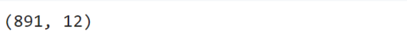
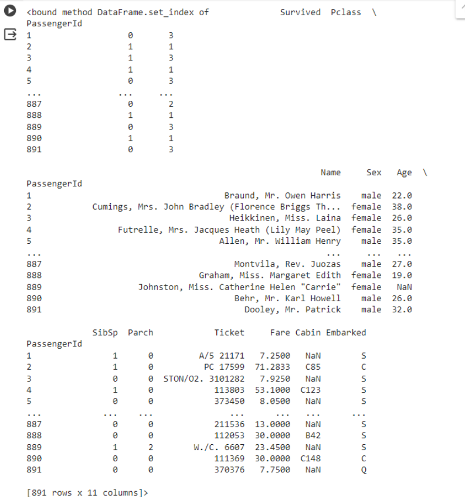

# EXNO2DS
## NAME: GURU REVANTH KUMARAVEL RADHIKA
## DEPARTMENT: AI&DS
## REGISTER NUMBER: 212223230065
# AIM:
      To perform Exploratory Data Analysis on the given data set.
      
# EXPLANATION:
  The primary aim with exploratory analysis is to examine the data for distribution, outliers and anomalies to direct specific testing of your hypothesis.
  
# ALGORITHM:
STEP 1: Import the required packages to perform Data Cleansing,Removing Outliers and Exploratory Data Analysis.

STEP 2: Replace the null value using any one of the method from mode,median and mean based on the dataset available.

STEP 3: Use boxplot method to analyze the outliers of the given dataset.

STEP 4: Remove the outliers using Inter Quantile Range method.

STEP 5: Use Countplot method to analyze in a graphical method for categorical data.

STEP 6: Use displot method to represent the univariate distribution of data.

STEP 7: Use cross tabulation method to quantitatively analyze the relationship between multiple variables.

STEP 8: Use heatmap method of representation to show relationships between two variables, one plotted on each axis.

## CODING AND OUTPUT
```
import pandas as pd
import numpy as np
import matplotlib.pyplot as plt
import seaborn as sns
df=pd.read_csv("/content/titanic_dataset.csv")
df
```

```
df.info()
```

```
df.shape
```

```
import pandas as pd
df=pd.read_csv("/content/titanic_dataset.csv")
df.set_index("PassengerId",inplace=True)
print(df.set_index)
```

```
df.describe()
```

```
df.nunique()
```

```
df["Survived"].value_counts()
```

```
per=(df["Survived"].value_counts()/df.shape[0]*100).round(2)
per
```

```
sns.countplot(data=df,x="Survived")
```

```
df
```

```
df.Pclass.unique()
```

```
df.rename(columns={'sex':'Gender'},inplace=True)
df
```

```
import seaborn as sns
df=pd.read_csv("/content/titanic_dataset.csv")
sns.catplot(x="Sex",col='Survived',kind="count",data=df,height=5, aspect=.7)
```

```
sns.catplot(x='Survived',hue='Sex',data=df,kind='count')
```

```
df.boxplot(column='Age',by="Survived")
```

```
sns.scatterplot(x=df['Age'],y=df["Fare"])
```

```
import matplotlib.pyplot as plt
fig,ax1=plt.subplots(figsize=(8,5))
pt=sns.boxplot(ax=ax1,x='Pclass',y='Age',hue='Sex',data=df)
```

```
sns.catplot(data=df,col='Survived',x='Sex',hue='Pclass',kind='count')
```

```
import seaborn as sns
corr=df.corr()
sns.heatmap(corr,annot=True)
```

```
sns.pairplot(df)
```


# RESULT
Codes are successfully executed
